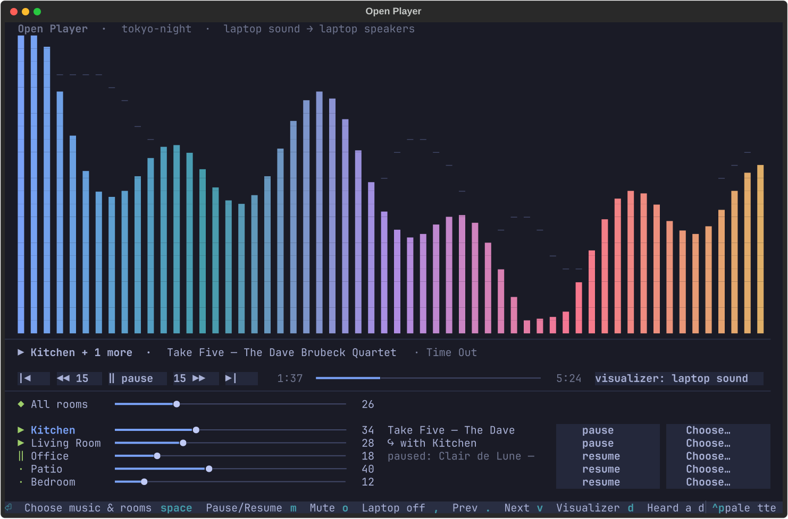
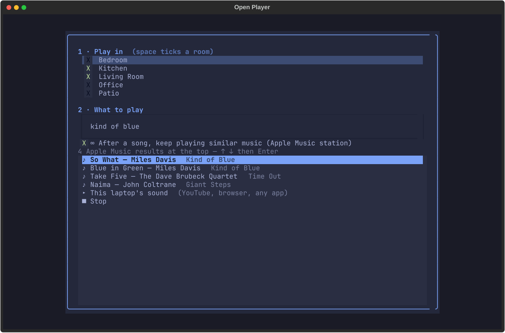

# Open Player for Sonos

A terminal mixer, player and music visualizer for Sonos speakers on Linux.
It is made for [Omarchy](https://omarchy.org) and takes on your Omarchy theme's colors, and it works on other Linux desktops too.

> **Not affiliated with or endorsed by Sonos, Inc.** Sonos is a trademark of Sonos, Inc.
> This project uses the speakers' local network interface through the open-source [SoCo](https://github.com/SoCo/SoCo) library.



## What it does

- **Mixer.** One volume slider per room, plus an "All rooms" master that keeps the balance between rooms. Click, drag, scroll or use the arrow keys.
- **Choose what plays, and where.** Tick any rooms and they play together in sync, then pick:
  - **Apple Music search.** The speakers stream the music themselves from Apple, lossless where Sonos supports it.
  - **"Keep playing similar music."** An Apple Music station started from any song.
  - **Your Sonos favorites** from any service linked in the Sonos app, such as Spotify, Amazon Music, YouTube Music or radio.
  - **This computer's sound.** Anything playing on the computer (a browser, YouTube, any app) goes to the speakers.
- **Now playing.** Previous or restart, back 15 s, play/pause, forward 15 s, next, and a progress bar you click to jump.
- **Visualizer** in your theme's colors. It follows the computer's sound, or, if you switch it on, listens to the room through the microphone, so it also reacts to music the speakers stream themselves. Nothing it hears is recorded or sent anywhere.
- **Network monitor (optional).** It watches every speaker for slow or missed replies and radio errors. Mark the moment you hear a dropout, and `openplayer netreport` lines up what the network was doing.



## Install

You need Linux with Python 3.11+, and PipeWire for the "computer sound" feature. You also need Sonos speakers set up with the official Sonos app, on the same network as the computer.

```sh
git clone https://github.com/Felbs/open-player-for-sonos
cd open-player-for-sonos
./install.sh                 # add --with-monitor for the network monitor
```

Then open **Open Player for Sonos** from your app launcher, or run `openplayer`.

The installer only writes to your home folder. In detail, it:
- creates a Python environment in `~/.local/share/openplayer`
- adds a launcher entry
- adds a virtual "Sonos" sound output (a PipeWire config and a marked block in `~/.asoundrc`)
- downloads [swyh-rs](https://github.com/dheijl/swyh-rs) (MIT) and verifies its checksum
- adds user services for streaming and for the monitor

If the `ufw` firewall is on, it **asks** before allowing your local network, and only your local network, to reach port 5901. The speakers need that port to fetch the computer's sound.

To remove everything, run `./uninstall.sh`. Add `--purge` to also delete your settings and monitor history.

## Keys

| Key | Action |
|---|---|
| ↑ ↓ | pick a room |
| ← → | room volume |
| Enter | choose music & rooms |
| Space | pause / resume |
| `,` `.` | previous / next |
| Shift+← → | back / forward 15 s |
| m | mute |
| v | visualizer: room mic → computer sound → off |
| d | mark a dropout (for the monitor) |
| o | stop sending the computer's sound |
| q | quit |

## Command line

```
openplayer rooms                     openplayer vol Kitchen 30
openplayer apple Kitchen take five   openplayer radio Kitchen so what
openplayer laptop Living Room        openplayer laptop off
openplayer join Patio Kitchen        openplayer netreport 2
```

`openplayer help` lists everything.

## Good to know

- **Setup still happens in the Sonos app.** Adding speakers, linking music services and Trueplay tuning all need the official app. After that, this app handles day-to-day playing.
- **Apple Music.** Search uses Apple's public catalog. It can't see your personal library, which Apple only allows for registered apps; save playlists as Sonos favorites instead. The store country comes from your system language (`LANG`), and you can override it with `OPENPLAYER_COUNTRY=GB`.
- **Computer sound runs 1–2 seconds behind**, which is fine for music but not for watching video.
- Tested on Sonos S2 with a mix of Sonos and IKEA SYMFONISK speakers. Reports from other setups are welcome.

## Development

```sh
python3 -m venv .venv && .venv/bin/pip install -e ".[test]"
.venv/bin/python -m pytest
.venv/bin/python -m openplayer
```

## License

MIT. See [LICENSE](LICENSE).
